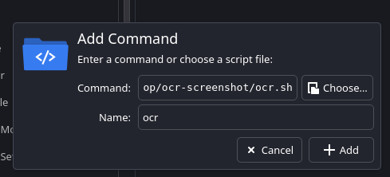
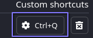

# OCR Screenshot

  

> **Captura pantalla y extrae texto automáticamente con OCR**

Script de bash que permite capturar una región de la pantalla y extraer texto usando reconocimiento óptico de caracteres (OCR). El texto extraído se copia automáticamente al portapapeles.


## Características
- **Captura de pantalla interactiva** con Flameshot

- **OCR multilingüe** (Español + Inglés)

- **Copia automática** al portapapeles

- **Notificaciones** de estado

## Instalación Rápida
### Opción 1: Instalación Automática
```bash

git  clone  https://github.com/tu-usuario/ocr-screenshot.git

cd  ocr-screenshot

chmod  +x  install.sh

./install.sh

```
### Opción 2: Instalación Manual
1.  **Instalación de dependencias:**
```bash
# Ubuntu/Debian
sudo  apt  install  flameshot  tesseract-ocr  tesseract-ocr-spa  xclip  libnotify-bin
# Para Wayland (opcional)
sudo  apt  install  wl-clipboard
# Arch Linux
sudo  pacman  -S  flameshot  tesseract  tesseract-data-spa  xclip  libnotify
# Fedora/RHEL
sudo  dnf  install  flameshot  tesseract  tesseract-langpack-spa  xclip  libnotify
```
2.  **Descarga y configuración  del script:**
```bash
wget  https://raw.githubusercontent.com/tu-usuario/ocr-screenshot/main/ocr.sh
chmod  +x  ocr.sh
sudo  mv  ocr.sh  /usr/local/bin/ocr-screenshot

```
## Uso

### KDE Plasma
- **Shortcut**
1. Configuración del sistema → Atajos de teclado
2. Escoger la opción de comando o script


3. Ingresar la ubicación del Script y añadir



4. Agregar combinación de teclas preferidas



### ¿Qué hace el script?

1. Abre Flameshot para seleccionar una región de la pantalla
2. Procesa la imagen con Tesseract OCR (español + inglés)
3. Copia el texto extraído al portapapeles
4. Muestra una notificación del resultado

## Dependencias

| Herramienta | Descripción | Instalación |
|--|--|--|
| **Flameshot** | Captura de pantalla interactiva | `sudo apt install flameshot` |
| **Tesseract OCR** | Motor de reconocimiento óptico | `sudo apt install tesseract-ocr` |
| **Tesseract Spanish** | Paquete de idioma español | `sudo apt install tesseract-ocr-spa` |
| **xclip** | Copia al portapapeles (X11) | `sudo apt install xclip` |
| **wl-clipboard** | Copia al portapapeles (Wayland) | `sudo apt install wl-clipboard` |
| **libnotify** | Notificaciones del sistema | `sudo apt install libnotify-bin` |


  

## Configuración

 
### Personalizar Idiomas
Edita el script para cambiar los idiomas de OCR:
```bash
# Cambiar de 'spa+eng' a otros idiomas
text=$(tesseract  /tmp/ocr-temp.png  stdout  -l  spa+eng  2>/dev/null)
# Ejemplos:
# -l eng # Solo inglés
# -l spa # Solo español
# -l fra+eng # Francés + inglés
# -l deu+eng+spa # Alemán + inglés + español
```

